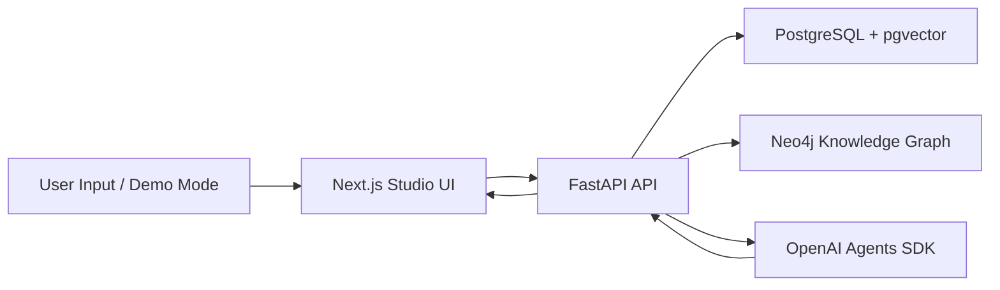
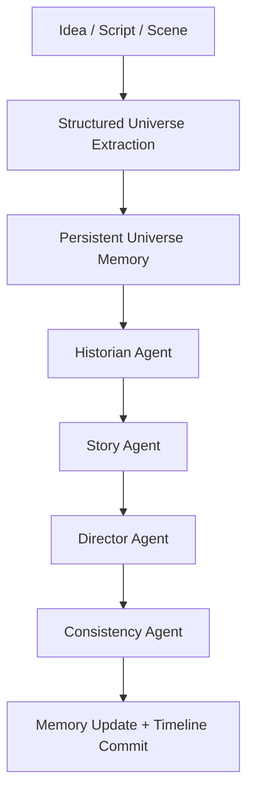
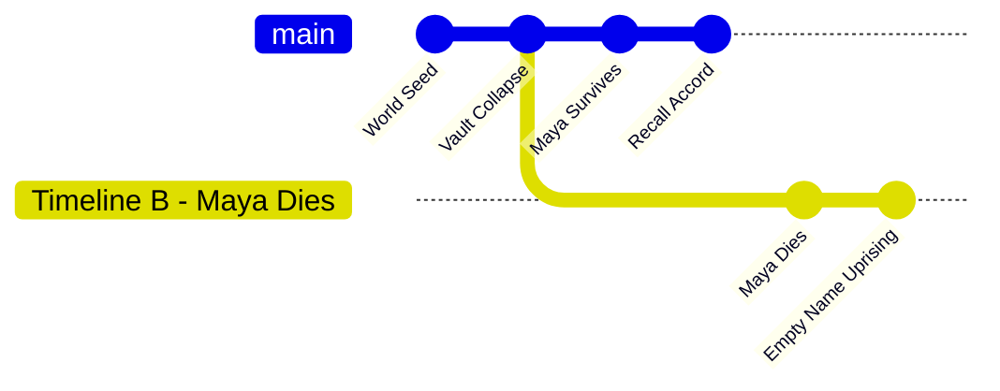

# Architecture Summary

## System Overview

Universe Studio is a memory-first storytelling system.

## Core Components

Frontend:

- Landing page and Demo Mode entry point
- Universes dashboard
- Create universe flow
- Character dossiers
- Memory Explorer using React Flow
- Timeline workbench
- Episode viewer
- Agent Trace tab
- Consistency dashboard

Backend:

- FastAPI API layer
- SQLAlchemy persistence models
- Alembic migrations
- Universe extraction services
- Character memory services
- Episode generation services
- Timeline branching services
- Consistency services
- Agent trace services
- Deterministic demo seeder

Databases:

- PostgreSQL stores durable state:
  - Universes
  - Characters
  - Locations
  - Objects
  - Events
  - Relationships
  - Timelines
  - Commits
  - Episodes
  - Scenes
  - Memory entries
  - Agent runs
  - Consistency checks
- Neo4j stores graph-ready relationships for visual exploration.

## Memory-First Flow

## Timeline Branching

Timeline A and Timeline B share history until the branch point. After divergence,
branch-aware memory retrieval prevents future facts from leaking across timelines.

## Agent Collaboration

- Historian Agent retrieves universe memory.
- Story Agent converts memory into narrative structure.
- Director Agent writes scenes and dialogue.
- Consistency Agent validates continuity.
- Memory Update stores durable consequences.

The Agent Trace UI shows these steps for judges and technical reviewers.

## Consistency Strategy

The Consistency Engine validates:

- Dead characters appearing alive
- Knowledge never learned
- Abrupt relationship changes
- Timeline causality errors
- World rule violations
- Branch leakage
- Impossible event ordering

Critical issues block persistence. Warnings are stored for review.
