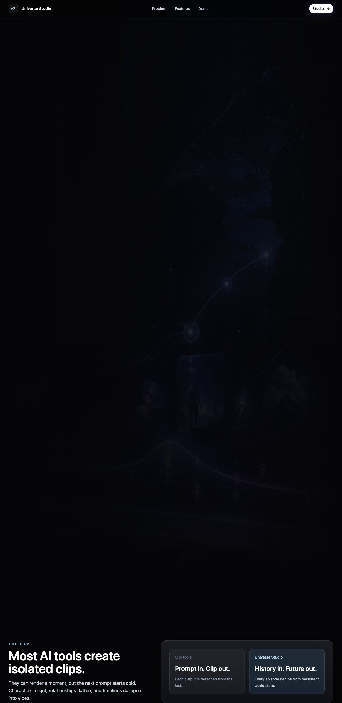
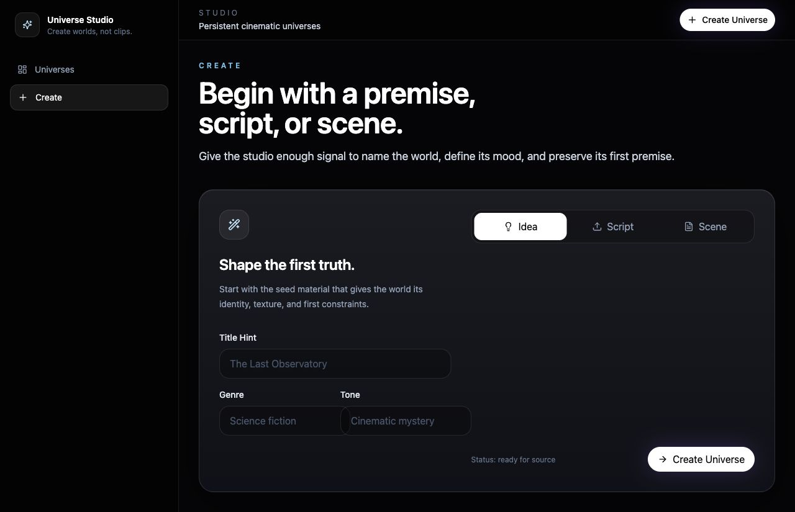
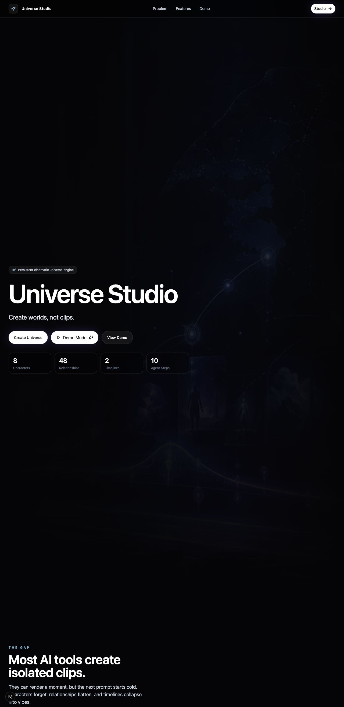
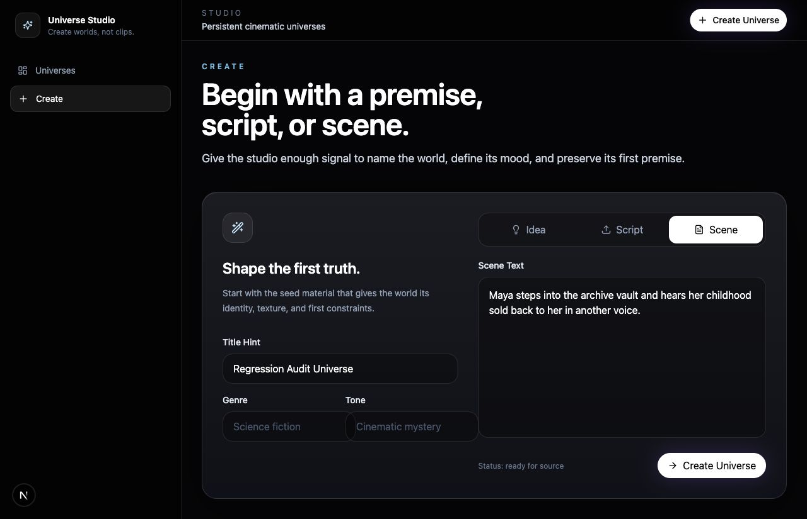
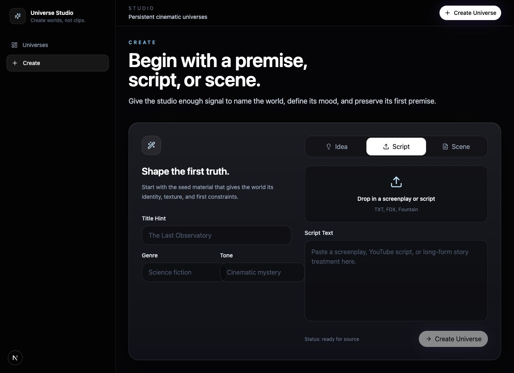
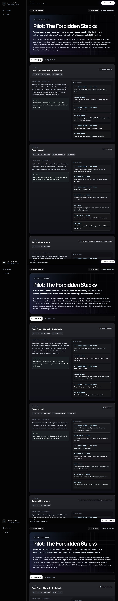
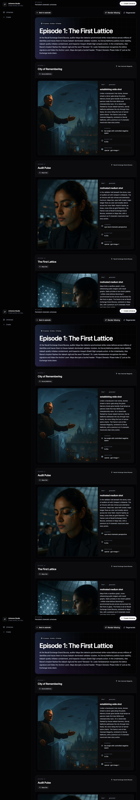

# Frontend Regression Audit

Date: 2026-06-07

## Root Cause

The live Next.js dev server was serving server-rendered pages while route-level client chunks were returning `404`, including:

- `/_next/static/chunks/app/page.js`
- `/_next/static/chunks/app/(studio)/universes/new/page.js`

That left the app visible only as SSR markup. Components using Framer Motion with `initial={{ opacity: 0 }}` stayed invisible because hydration never advanced them to `animate={{ opacity: 1 }}`. The same missing client runtime left create-page tab buttons unresponsive.

The Create Universe workflow also had a real product gap: the Script tab supported file upload only, but not pasted script text.

## Fixes

- Cleared the stale `.next` cache and restarted the frontend dev server.
- Replaced SSR-hidden Framer Motion `initial={{ opacity: 0, ... }}` states with `initial={false}` across studio surfaces, so critical UI remains visible even if hydration is delayed.
- Added a Script Text textarea to the Create Universe Script tab.
- Updated script submission logic so the form accepts either an uploaded file or pasted script text.

## Validation Screenshots

### Before

### After

## Browser Validation

- Landing page hero visible.
- Landing page CTA buttons visible.
- Landing page demo and feature sections visible.
- Create Universe Idea textarea visible and writable.
- Script tab switches correctly.
- Script tab upload area visible.
- Script tab paste textarea visible and writable.
- Scene tab switches correctly.
- Scene textarea visible and writable.
- Form state persists while switching tabs.
- Universe creation succeeds through the browser.
- Universe detail page renders created universe.
- Timeline page renders timeline history.
- Consistency dashboard renders.
- Episode generation succeeds through the browser.
- Storyboard page renders real `image/png` storyboard frames.

## API Sanity Results

Created universe:

- ID: `8a9397ee-d6fd-4ce1-9e6f-f41ac65cc8ee`
- Characters: 5
- Timelines: 1
- Timeline events: 20

Generated episode:

- ID: `9806d394-eeeb-4d07-ab06-79f0e0c8f40a`
- Scenes: 8
- Agent trace steps: 5

Existing storyboard validation:

- Episode ID: `42ad487a-490c-4f0e-b3b8-07f61de9b475`
- Storyboard frames: 8
- Frame provider: `openai`
- Frame model: `gpt-image-1`
- Frame MIME type: `image/png`
